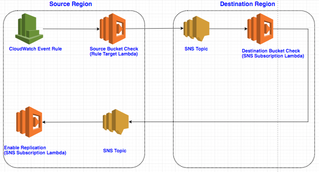

# Amazon S3 Cross Region Disaster Recovery

“You can’t predict a disaster, but you can be prepared for one!”

Disaster Recovery (DR) is one of most important requirements that we hear from our customers.

Most of the AWS services are designed with some DR considerations in mind, especially the widely used S3, which is designed with 99.999999999% durability and 99.99% availability by redundantly storing your data across multiple AZs within a region.

It may be rare for the whole region to go down, but it could cause massive permanent damage if we don't plan it well. And this is when our **Cross-Region Replication (CRR)** solution comes into play.

## Solution Overview

Here is an overall design based on CloudWatch, SNS and Lambda. And use Ansible Playbook to automate the deployment, or you can choose any infrastructure-as-code framework that has AWS support or ability to invoke AWS Web API.

The goal of the solution is for all S3 buckets in source region, if the bucket has the disaster recovery tag (e.g. "DR: true") attached to it, then this bucket is in the disaster recovery scope, and our solution will apply to this bucket to setup the cross-region replication.

We use a CloudWatch Event Rule to monitor events that will trigger the DR process and use lambda functions to enable the Cross-Region Replication, the communication between the two regions is taken care of by SNS Topics.

Here is an overview of how the solution works:



* Step 1 - The DR solution will be triggered by two CloudWatch events - `PutBucketTagging` and `DeleteBucketReplication` on the source S3 bucket.
> Note: When you create a bucket with tags, both `CreateBucket` and `PutBucketTagging` events are triggered, therefore you only need to monitor `PutBucketTagging` instead of both events.

* Step 2 - The CloudWatch rule will trigger the `source_bucket_check` Lambda function which enables [versioning](http://docs.aws.amazon.com/AmazonS3/latest/dev/Versioning.html) on the source bucket.

* Step 3 - After enabling source bucket versioning, the `source_bucket_check` function sends the source bucket name in a JSON message to the `sns_topic_01` SNS topic in the destination region.

* Step 4 - The Lambda function (called `destination_bucket_check`) which subscribed to topic sns_topic_01 will be triggered, and it will create the destination bucket in the DR region and enable versioning.

* Step 5 - Function `destination_bucket_check` sends a message to another SNS topic (called sns_topic_02) which is defined in the source region with source bucket name info.

* Step 6 - The Lambda function (called `enable_replication`) which subscribed to topic `sns_topic_02` will be triggered, and it will enable cross-region replication on the source bucket.

All these AWS resources are deployed using Ansible Playbook.

Since S3 Cross-Region Replication only watches the source buckets for new and updated objects, if you need to replicate existing objects, you can consider using [S3 sync API](http://docs.aws.amazon.com/cli/latest/reference/s3/sync.html) to bring the destination bucket up to date.

## Environment Setup and Solution Deployment

Here are the steps to get the solution up and running so you can see the result first before we dig into more details.

1. Install and set up below environment on your local machine assuming you are using Linux or MacOS:

* Ansible 2.4.1+
* Python 3.6+
* Boto3 1.4.8+
* Botocore 1.8.1+
* AWS CLI

2. Create an IAM role with following permissions, and make sure your user have the permission to assume this Role.

* CloudWatch Full Access
* Lambda Full Access
* SNS Full Access
* S3 Full Access

3. Add below trusted entities to the role, so these services can operate on your behalf:

* The identity provider(s) s3.amazonaws.com
* The identity provider(s) events.amazonaws.com
* The identity provider(s) lambda.amazonaws.com

4. Set user access key and secret key in ~/.bash_profile

```bash
export AWS_ACCESS_KEY_ID='YourAccessKeyID'
export AWS_SECRET_ACCESS_KEY='YourSecretAccessKey'
```

5. Clone this repository to your local machine.

6. Update the the variables in Ansible playbook _./playbooks/dr_setup_cloudwatch.yml_ 

```yaml
  vars:
    # Update this with the IAM role you created in step 2 above.
    dr_role_arn: '<IAM role arn>'
    # Update this with your desired source region
    source_region: 'us-west-2'
    # Update this with your desired destination region
    dest_region: 'us-east-2'
    # matching tag for DR enabled bucket in json format. 
    # NOTE: please keep the extra space in the beginning.
    match_tagging: ' {"dr": "true"}'
```

7. Run the Ansible playbook

```bash
cd playbooks
ansible-playbook dr_setup_cloudwatch.yml -vvv
```

8. Test the solution by creating a new bucket (e.g dr-test-bucket) with tag "dr: true" in your source region, wait for a few second, a bucket with name dr-test-bucket-dr should be created automatically in the destination region, and the replication should be enabled on source bucket (dr-test-bucket) against the target bucket (dr-test-bucket-dr). You can try to add some objects to the source bucket and check the destination bucket in a few seconds to make sure they can be replicated successfully.

>NOTE: the solution by default only support S3 AES 256 encryption. You'll need additional logic to handle KMS encryption.

Great, now you have the solution up and running on your environment. Let's see how it works in detail in following sections.

## Some key considerations about S3 Cross-Region Replication (CRR)

Before we drill into detail code, let's take a closer look at the S3 Cross-Region Replication feature provided by AWS.

* CRR applies to new and updated objects in the S3 source buckets, any objects stored prior to enabling this feature are not replicated
* The source and destination buckets must have versioning enabled.

* The replication process also copies any metadata and ACLs (Access Control Lists) associated with the object, however, the bucket level permissions and properties are not replicated

* CRR supports both AES-256 and KMS encryption, but KMS encryption is turned off by default

* Every S3 bucket has a unique name, so if you’d like to start using your S3 replica, you will need to manually update and configure your applications to refer to the destination buckets.

* It is difficult to manually enable and manage cross-region replication for hundreds of buckets, so we need a way to automate it.

For more details, please refer to [What Is and Is Not Replicated](http://docs.aws.amazon.com/AmazonS3/latest/dev/crr-what-is-isnot-replicated.html)

## Lambda Functions

All lambda functions is written in Python 3 and use boto3 to access AWS APIs. It is pretty straight forward with only one thing to keep in mind, lambda functions has a built-in environment with boto3 integrated, but the version may be lower than the latest boto3 release. So if you want to use some of the new features in latest boto3, you'll need to package the latest boto3 with your lambda function.

e.g. by the time I am writing this blog, AWS has boto3 1.4.7 and it doesn't support KMS encrypted cross-region replication, while 1.4.8 does. Here are the details steps:

```
# create a separate directory
$ mkdir s3-dr-replication

# download the latest boto3 into the directory
$ pip3 install -t ./s3-dr-replication

# copy the lambda function (e.g.s3_dr_replication.py) to the directory
$ cp s3_dr_replication.py ./s3-dr-replication

# create a zip file contains all the files
cd s3-dr-replication
zip -r s3-dr-replication.zip .
cp s3-dr-replication.zip ..
```

## Ansible Playbook

Something to keep in mind for the ansible playbook:
1. Ansible's AWS support depends on boto/boto3 and AWS CLI

2. Use localhost since we are only using your local machine to send API requests to AWS and all resources will be created on cloud

3. Set gather_facts to true, since the playbook needs access to environment variables set in previous section to get your key id and access key.

4. Use sts_assume_role module to assume the role created above, and use the session_token from the assumed sts role to perform all other tasks.

```yaml
  tasks:
    - name: Assume role
      sts_assume_role:
        region: 'us-west-2'
        role_arn: '{{ dr_role_arn }}'
        role_session_name: "ansible_sandbox"
      register: assumed_role

    - name: Create SNS topics
      sns_topic:
        name: 'topic_1'
        aws_access_key: '{{ assumed_role.sts_creds.access_key }}'
        aws_secret_key: '{{ assumed_role.sts_creds.secret_key }}'
        security_token: '{{ assumed_role.sts_creds.session_token }}'
        ...
```

5. Create the 3 lambda functions, then 2 SNS topics and SNS subscriptions, at last create the CloudWatch event rule.

6. Use lambda_policy module to add policy to each lambda function to allow SNS and CloudWatch to invoke them.

```
      lambda_policy:
        state: 'present'
        function_name: 'source_bucket_check'
        statement_id: 'unique_id'
        action: lambda:InvokeFunction
        principal: 'events.amazonaws.com'
        source_arn: '{{ arn_of_cloud_watch_rule }}'
        region: '{{ target_region }}'
```

Most of the Ansible modules are idempotent. And use -vvv option to see detail logs.

## Bucket properties and permissions

Cross-region replication will not take care of the properties e.g. permissions, taggings, lifecycle rules. So you'll need to write your own code to clone all these properties. Boto3 has very good support on all these APIs.

## Why CloudWatch Event Rule

To fully automate the DR process, we need to monitor the tags of S3 buckets to see if it fits the matching tag we defined e.g. dr=true, so we can trigger the process to enable CRR for it.

We basically have two choices, CloudWatch and AWS Config.
Both of them can monitor bucket changes and invoke a lambda function to handle the changes.
AWS Config focus more on compliance check, so it'll check changes of all buckets every a few minutes.
CloudWatch is event based, so it only gets triggered when a specific event happened.

So we choose CloudWatch event rule because it's faster and consume less resources.

For more details please refer to: [Amazon CloudWatch Events](http://docs.aws.amazon.com/AmazonCloudWatch/latest/events/WhatIsCloudWatchEvents.html) and [AWS Config](http://docs.aws.amazon.com/config/latest/developerguide/WhatIsConfig.html)

## Conclusion

AWS provides a very good cross-region replication feature for S3, and to make it work in real life scenario, we need some scripting work to enable/disable replication based on tags, set the replication rule with proper encryption options, clone bucket properties and permissions, copy existing objects and automate all of these process.

Hope this post can help you to create a skeleton of an automated S3 cross-region DR solution. Contact us if you need more support.